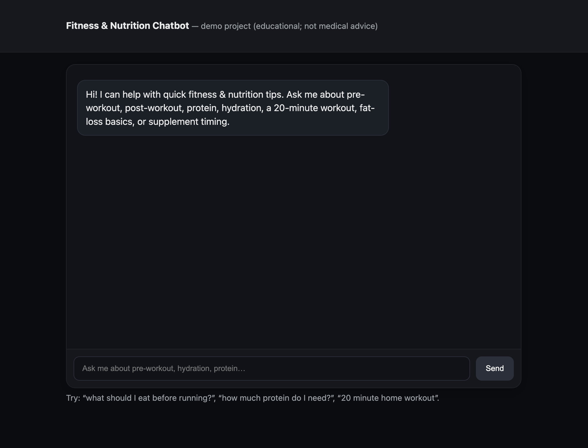

# 🏋️‍♀️ Fitness & Nutrition Chatbot

 
 

> A **Flask-based web chatbot** that answers **fitness & nutrition questions** with a custom knowledge base, semantic Q&A (TF-IDF + cosine similarity), and a modern chat UI.  
> 🚀 **Live Demo:** https://fitness-bot-ketp.onrender.com/

⚠️ **Disclaimer:** All responses are for **educational purposes only** and are *not medical advice*.  

---
## 📸 Demo Screenshot

Here’s the chatbot running in the browser:

---

## 🚀 Features
- Built with **Flask** (Python web framework)  
- Simple **knowledge base** powered by TF-IDF + cosine similarity  
- Interactive **chat UI** with a modern dark theme  
- Covers fitness & nutrition basics:  
  - Pre-workout & post-workout meal ideas  
  - Daily protein needs  
  - Hydration strategies  
  - Quick home workouts  
  - Fat loss fundamentals  
  - Supplement timing (protein, creatine, collagen)  
- Easy to extend — just add more Q&A pairs in the knowledge base  

---

## 🛠️ Tech Stack
- **Python 3**  
- **Flask** (web framework)  
- **scikit-learn** + **numpy** (text similarity engine)  
- HTML, CSS, JavaScript (front-end chat interface)  

---

## 📂 Project Structure
fitness-bot/
│── app.py # Main Flask app
│── requirements.txt # Project dependencies
│── Procfile # (Optional) for deployment on Render/Heroku
│── README.md # Project documentation
└── .venv/ # Virtual environment (not uploaded to GitHub)
